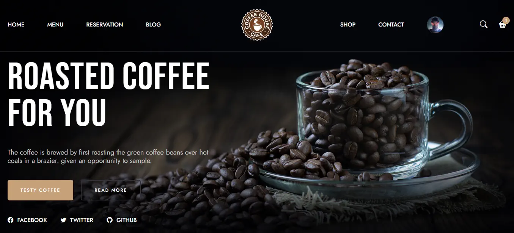
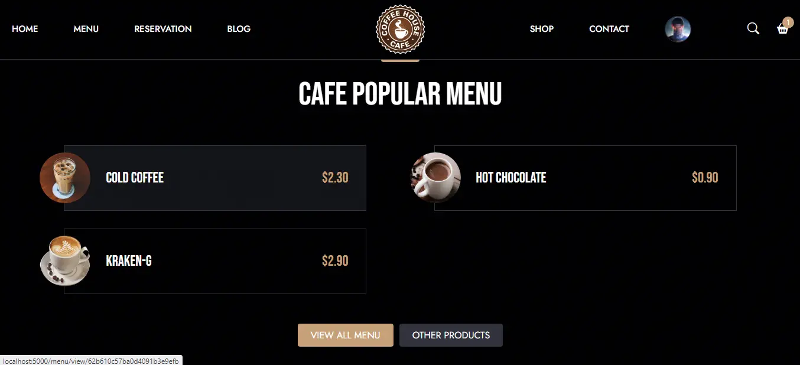
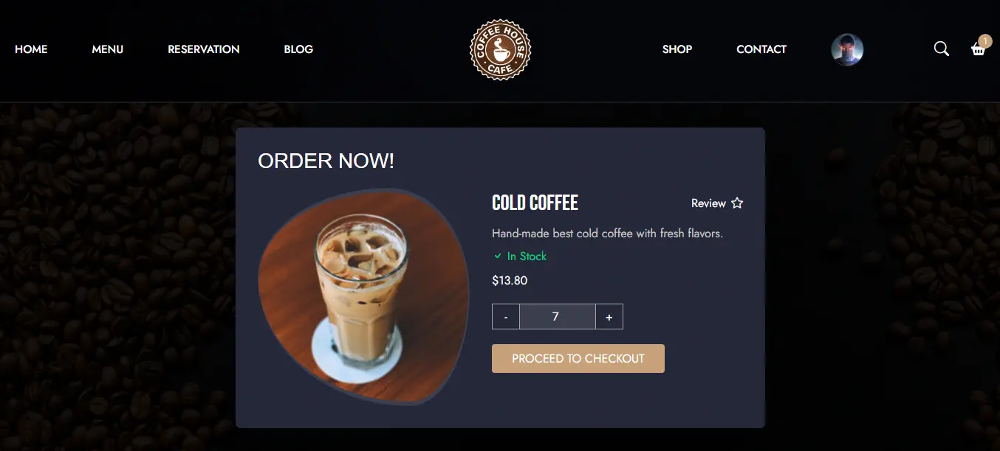
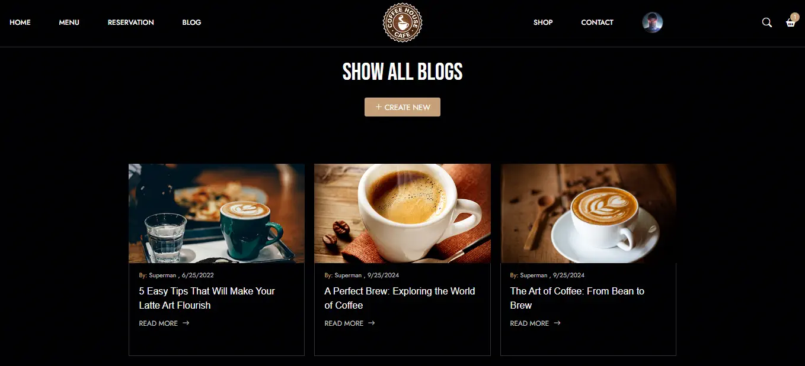
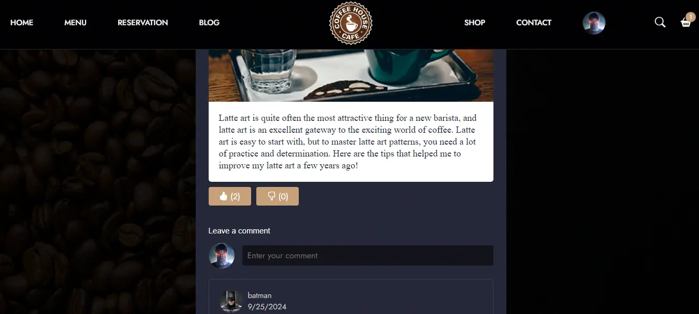
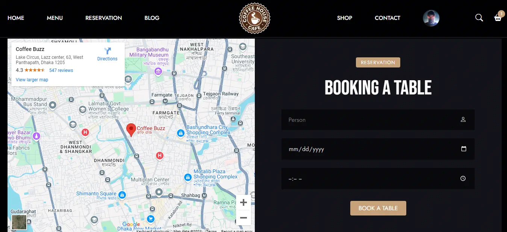
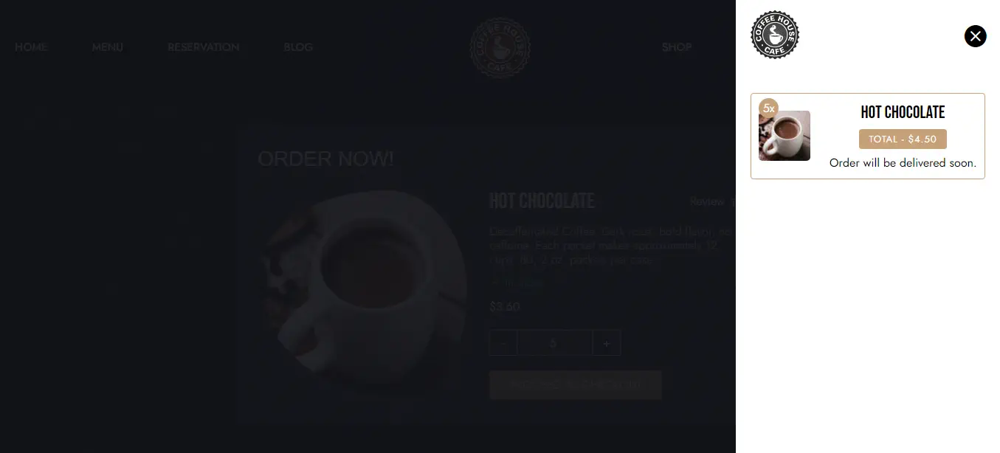
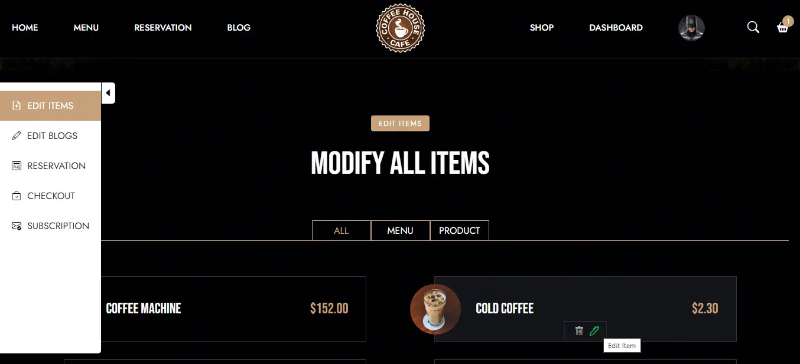

# Coffee shop

#### In this project I have created a coffee shop management system with two category of user availability, Customer and Admin. I mainly focused on the backend system most and took inspiration from a html template from theme forest to create the frontend in EJS.

---

    
    

---

    
    

---

    
    

---

---

### Created users:

email: superman@gmail.com 
password: superman 
role: user 
 
email: batman@gmail.com 
password: batman 
role: admin 

#### Note: You can create user as your own.

### The technologies, I have used for this project:

1. EJS
2. SCSS
3. Javascript (client-side)
4. Nodejs (Server-side)
5. Express
6. MongoDB
7. Mongoose
8. jQuery
